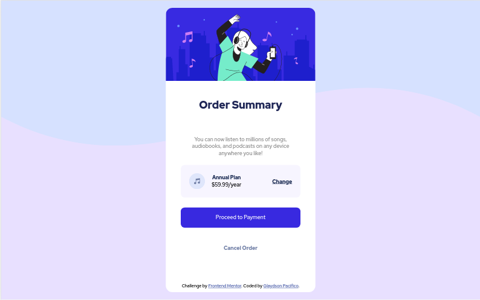

# Frontend Mentor - Order summary card solution

This is a solution to the [Order summary card challenge on Frontend Mentor](https://www.frontendmentor.io/challenges/order-summary-component-QlPmajDUj). Frontend Mentor challenges help you improve your coding skills by building realistic projects.

## Table of contents

- [Overview](#overview)
  - [The challenge](#the-challenge)
  - [Screenshot](#screenshot)
  - [Links](#links)
- [My process](#my-process)
  - [Built with](#built-with)
  - [Continued development](#continued-development)
- [Author](#author)

## Overview

This was a feel good challenge for me as the UI was great and it did not take too long to code. I will probably make a dark mode version of this for kicks

### The challenge

Users should be able to:

- See hover states for interactive elements

### Screenshot

### Links

- Solution URL: [Solution Url]()
- Live Site URL: [Live site](https://order-summary-component-main-three.vercel.app/)

## My process

I started out just laying everything out. The challenge had some starter code i had to put into tags. After i got the basic layout done i started to add style to make it look like the part.

### Built with

- Semantic HTML5
- CSS3
- Flexbox
- Mobile-first workflow

### Continued development

I had a hard time vertically centering the card so i want to work more with using vh or percentages to add margin to my elements

## Author

- Frontend Mentor - [@GlaydsonPacifico](https://www.frontendmentor.io/profile/GlaydsonPacifico)